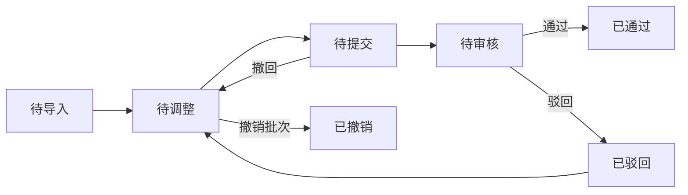
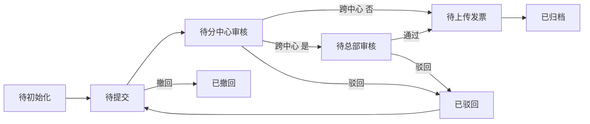
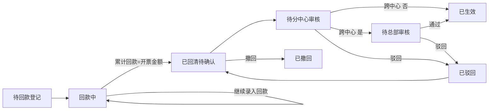
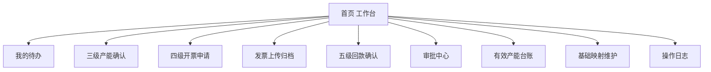
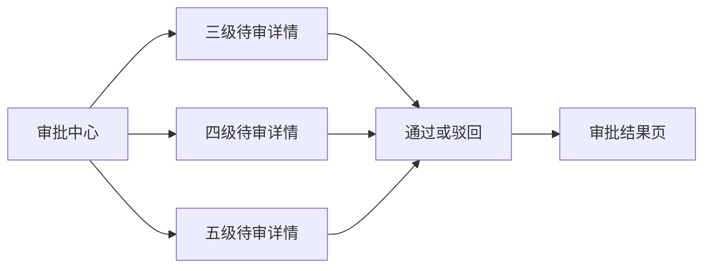

# 产能账户子系统需求分析

## 1. 目标范围

本阶段聚焦三级、四级、五级产能确认流程，形成从客户验收到开票、再到回款确认的闭环。

- 三级产能确认：销售根据客户确认结果进行调整和确认，分中心负责人审核通过后生效。
- 四级产能确认：销售基于已生效三级产能发起开票申请，分中心负责人审核，销售上传发票附件后归档。
- 五级产能确认：财务根据开票记录人工录入回款，销售根据回款情况调整产能或金额，分中心负责人审核后生效。

当前阶段先支持人工录入和人工处理，后续再扩展自动抓取、自动解析能力。

## 2. 业务边界

### 2.1 本期纳入范围

- 三级产能导入、调整、确认、审批、撤销
- 四级开票申请、审批、销售上传发票、归档
- 五级回款登记、分次回款、销售调整、审批
- 审批流转、驳回、撤回、重新提交
- 有效产能台账查询
- 附件管理、操作留痕、版本留痕

### 2.2 本期暂不纳入范围

- 自动抓取网银回款
- 邮件、企微自动爬取
- 发票 PDF 自动解析
- 负工作量、负金额、冲红场景
- 六级及以上产能确认

## 3. 关键业务口径

### 3.1 三级产能口径

- 三级产能粒度确认到人天。
- 三级来源为客户验收单或客户确认结果。
- 不同客户可能存在不同数据格式，但系统统一按核心字段归集。
- 三级审核通过后，方可作为四级初始化来源。

### 3.2 四级产能口径

- 四级来源于已审核通过的三级产能。
- 销售可基于三级结果发起开票申请。
- 销售可按项目调整金额，也可细化到人员调整。
- 发票附件由销售上传。

### 3.3 五级产能口径

- 财务按发票记录人工录入回款。
- 支持同一发票多次回款登记，直至完全回款。
- 销售可在回款阶段继续按项目或按人员明细调整。
- 五级审核通过后，作为当前最高有效确认结果。

### 3.4 跨中心审批口径

- 以模式区分客户。
- 单一中心下，按各分中心审批。
- 涉及多个中心的场景，由总部运营中心审批。

## 4. 角色与职责

### 4.1 销售

- 查看三级原始识别结果
- 调整三级产能并提交确认
- 发起四级开票申请
- 上传发票附件
- 根据回款情况调整五级产能或金额
- 查询本人发起单据和审批结果

### 4.2 分中心负责人

- 审核三级产能确认
- 审核四级开票申请
- 审核五级回款后调整确认
- 对本中心范围内单据执行驳回、退回、通过

### 4.3 总部运营中心

- 审核跨多个中心的单据
- 查看跨中心汇总情况

### 4.4 财务

- 查看已审批通过的开票单
- 根据开票记录维护回款信息
- 对同一发票分次录入回款

### 4.5 系统管理员或运营管理员

- 导入基础数据和批次数据
- 维护客户、合同、岗位、单价等映射关系
- 执行批次撤销和异常处理

## 5. 核心数据对象

## 5.1 三级产能单

单头字段建议包括：

- 三级单号
- 客户
- 中心
- 分中心
- 期间月份
- 数据来源类型
- 导入批次号
- 状态
- 提交人
- 提交时间
- 审核人
- 审核时间
- 审核意见

明细字段建议包括：

- 客户
- 合同
- 合同岗位
- 项目或需求
- 人员
- 单价
- 产能人天
- 金额
- 调整前人天
- 调整后人天
- 调整前金额
- 调整后金额
- 调整原因

## 5.2 四级开票单

单头字段建议包括：

- 开票申请单号
- 关联三级单号
- 客户
- 中心
- 分中心
- 是否跨中心
- 审批层级
- 发票状态
- 申请人
- 申请时间
- 审核人
- 审核时间

明细字段建议包括：

- 客户
- 合同
- 合同岗位
- 项目或需求
- 人员
- 单价
- 产能人天
- 金额
- 调整方式
- 调整前金额
- 调整后金额
- 调整前人天
- 调整后人天

附件字段建议包括：

- 发票号码
- 发票代码
- 开票日期
- 含税金额
- 税率
- 附件名称
- 附件上传人
- 附件上传时间

## 5.3 五级回款单

单头字段建议包括：

- 回款确认单号
- 关联开票申请单号
- 关联发票号码
- 客户
- 中心
- 分中心
- 回款状态
- 累计回款金额
- 未回款金额
- 是否回清

回款记录字段建议包括：

- 回款序号
- 回款日期
- 回款金额
- 付款方
- 回款账号
- 备注
- 录入人
- 录入时间

调整字段建议包括：

- 调整维度
- 项目调整金额
- 人员调整金额
- 人员调整人天
- 调整原因
- 调整前后对比值

## 5.4 有效产能台账

用于展示当前生效结果，建议字段包括：

- 客户
- 合同
- 合同岗位
- 项目或需求
- 人员
- 当前有效级别
- 当前有效人天
- 当前有效金额
- 来源单据
- 最近生效时间

## 6. 核心关联主键

由于不同客户格式可能不同，不建议依赖单一需求编号。当前建议以业务组合键做主关联，核心维度如下：

- 客户
- 合同
- 合同岗位
- 单价
- 产能人天
- 金额

在系统实现上，建议增加内部业务主键，避免因外部 Excel 格式差异造成关联失败。外部字段用于匹配，内部主键用于追踪版本和流转。

## 7. 业务流程

### 7.1 三级产能确认流程

1. 管理员或系统导入三级原始数据。
2. 系统识别客户、合同、岗位、单价、人天、金额等信息。
3. 销售查看待确认三级数据。
4. 销售对人天或金额进行调整，并填写调整原因。
5. 销售提交三级确认申请。
6. 分中心负责人审核。
7. 审核通过后，三级产能生效。
8. 审核驳回后，退回销售修改。

### 7.2 四级开票确认流程

1. 销售选择已生效三级产能初始化四级数据。
2. 销售按项目调整金额，或细化到人员调整人天和金额。
3. 销售提交开票申请。
4. 分中心负责人审核。
5. 涉及多个中心时，流转总部运营中心审批。
6. 审批通过后，销售上传发票附件。
7. 系统归档四级产能及发票信息。
8. 审批驳回后，退回销售修改并重新提交。

### 7.3 五级回款确认流程

1. 财务查看已归档发票。
2. 财务按发票人工录入回款记录。
3. 同一发票支持多次录入，系统自动累计已回款金额和剩余未回款金额。
4. 回款过程中，销售可按项目或人员调整人天和金额。
5. 销售提交五级确认申请。
6. 分中心负责人审核。
7. 涉及多个中心时，流转总部运营中心审批。
8. 审核通过后，五级产能生效，覆盖当前有效结果。
9. 审核驳回后，退回销售修改。

## 8. 状态设计

### 8.1 三级状态

- 待导入
- 待调整
- 待提交
- 待审核
- 已通过
- 已驳回
- 已撤销

### 8.2 四级状态

- 待初始化
- 待提交
- 待分中心审核
- 待总部审核
- 待上传发票
- 已归档
- 已驳回
- 已撤回

### 8.3 五级状态

- 待回款登记
- 回款中
- 已回清待确认
- 待分中心审核
- 待总部审核
- 已生效
- 已驳回
- 已撤回

## 9. 审批与留痕要求

- 所有调整均需保留调整前、调整后、调整原因。
- 所有审批均需保留审批人、审批时间、审批意见。
- 支持驳回后重新提交。
- 支持发起人撤回未终审单据。
- 支持查看完整操作日志。
- 支持查看版本历史。

## 10. 关键校验规则

### 10.1 通用校验

- 客户不能为空。
- 合同不能为空。
- 合同岗位不能为空。
- 单价不能为空且必须大于 0。
- 产能人天不能为空且必须大于等于 0。
- 金额不能为空且必须大于等于 0。

### 10.2 三级校验

- 未完成调整的数据不可提交。
- 审核通过前，不可下推四级。
- 已审核通过的数据如需变更，应通过撤销或新版本机制处理。

### 10.3 四级校验

- 四级只能从已生效三级初始化。
- 当三级数据不完整时，不允许生成四级。
- 上传发票前，单据必须已审批通过。
- 一个发票单据必须归属明确的审批中心。

### 10.4 五级校验

- 回款累计金额不得超过开票金额。
- 未回清前，状态为回款中。
- 完全回款后，方可进入最终确认。
- 回款后调整必须重新走审批流。

## 11. 页面建议

- 三级产能确认列表页
- 三级产能确认详情页
- 四级开票申请列表页
- 四级开票申请详情页
- 发票上传与归档页
- 五级回款登记列表页
- 五级回款登记详情页
- 我的待办页
- 审批中心页
- 有效产能台账页
- 基础映射维护页
- 操作日志页

## 12. 原型设计重点

后续原型设计建议重点表现以下能力：

- 同一流程下的角色分工差异
- 单头与明细双层结构
- 调整前后对比展示
- 驳回、撤回、重新提交的状态切换
- 跨中心单据的审批分流
- 发票与回款的附件和记录展示
- 有效产能台账如何从三级、四级、五级逐级覆盖

## 13. 后续迭代方向

- 邮件自动抓取验收单
- 企业微信自动抓取验收单
- 发票 PDF 自动解析
- 网银回款自动抓取
- 自定义拆分规则
- 更多客户个性化模板适配

## 14. 状态流转图

本章节用于指导后续原型中的状态标签、按钮显隐和审批动作。

### 14.1 三级产能状态流转

说明：

- 三级数据导入后进入待调整。
- 销售完成调整后进入待提交。
- 提交后进入待审核，由分中心负责人审批。
- 驳回后退回待调整。
- 审核通过后进入已通过，才允许初始化四级。

### 14.2 四级开票状态流转

说明：

- 四级必须由已通过的三级初始化产生。
- 单中心单据由分中心负责人审批通过后，直接进入待上传发票。
- 跨中心单据需先经分中心负责人，再流转总部运营中心审批。
- 销售上传发票附件后，单据进入已归档。

### 14.3 五级回款状态流转

说明：

- 财务录入首笔回款后，单据进入回款中。
- 回款未完成前允许继续追加回款记录。
- 完全回款后，销售才能发起最终确认。
- 五级审核通过后，覆盖当前有效产能结果。

### 14.4 状态与操作映射

| 级别 | 状态 | 主要操作角色 | 允许操作 |
| --- | --- | --- | --- |
| 三级 | 待调整 | 销售 | 编辑明细、调整人天、调整金额、保存 |
| 三级 | 待提交 | 销售 | 提交、撤回 |
| 三级 | 待审核 | 分中心负责人 | 通过、驳回 |
| 四级 | 待提交 | 销售 | 调整项目金额、细化到人员、提交、撤回 |
| 四级 | 待分中心审核 | 分中心负责人 | 通过、驳回 |
| 四级 | 待总部审核 | 总部运营中心 | 通过、驳回 |
| 四级 | 待上传发票 | 销售 | 上传附件、补录发票信息 |
| 五级 | 回款中 | 财务 | 新增回款记录、修改备注 |
| 五级 | 已回清待确认 | 销售 | 调整项目金额、调整人员明细、提交、撤回 |
| 五级 | 待分中心审核 | 分中心负责人 | 通过、驳回 |
| 五级 | 待总部审核 | 总部运营中心 | 通过、驳回 |

## 15. 页面流转图

本章节用于指导后续原型中的菜单结构、页面入口和角色跳转路径。

### 15.1 总体页面结构

### 15.2 销售页面流转

说明：

- 销售主线贯穿三级确认、四级申请、发票上传和五级最终确认。
- 原型中应突出待办入口，减少销售在菜单间来回切换。

### 15.3 财务页面流转

说明：

- 财务主要聚焦发票对应的回款登记。
- 回款登记详情页需要支持多次新增记录，并实时展示累计结果。

### 15.4 审批页面流转

说明：

- 审批中心应统一承接三级、四级、五级待审任务。
- 原型中要支持审批人快速查看单头、明细、调整前后差异、附件和历史意见。

### 15.5 页面布局建议

- 列表页统一采用顶部筛选区、中部表格区、右侧或弹窗查看审批轨迹。
- 详情页统一采用单头信息、明细表格、调整对比区、附件区、审批意见区五段结构。
- 五级详情页需额外展示回款记录时间轴或回款台账表。
- 跨中心单据需在单头位置明显展示跨中心标识和当前审批层级。

## 16. 后续原型输出顺序建议

建议按以下顺序继续产出低保真原型：

1. 首页工作台与我的待办
2. 三级产能确认列表页与详情页
3. 四级开票申请列表页与详情页
4. 发票上传归档页
5. 五级回款确认列表页与详情页
6. 审批中心页
7. 有效产能台账页